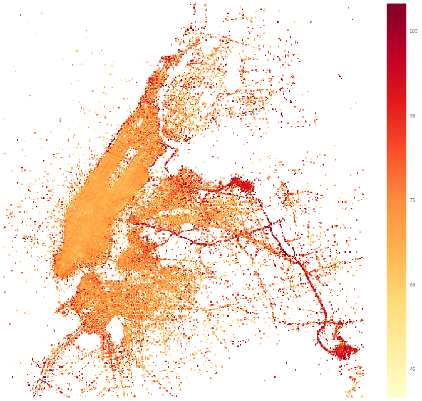

Title: About
Date: 2014-09-26
Slug: about
Authors: Roberto Gobbetti
Summary: Short description
url: /
save_as: index.html



I am a cosmologist, which means I invent ways to create the universe. I use string theory to do that.

I love data too. I enjoy recovering stories from messy piles of information. I use python to do that.

[//]: # (I like data too. I have a newfound excitement in recovering a story from messy piles of information. I use python to do that.)

You can find me in the Netherlands as well as in New York City. I am based in the former where I hold a position at Delta-ITP. I studied in NYC and still spend a great deal of time there.

Here are some of the things I worked and am working on.

[//]: # (I am a postdoctoral researcher at [Delta Institute for Theoretical Physics](http://www.d-itp.nl/) and at the [Institute for Theoretical Physics](http://web.science.uu.nl/itf/), at [Utrecht University](www.uu.nl/en). I moved to the Netherlands after receiving my Ph.D. in Physics at [New York University](http://www.nyu.edu) where I worked at the [Center for Cosmology and Particle Physics](http://ccpp.nyu.edu/).)

[//]: # (I work both on Cosmology and String Theory, trying to explain the first using the second. I was born in Milan, Italy, and before moving to New York City I studied Physics at [Pavia University](http://www.unipv.eu/site/en/home.html) and [SISSA](https://www.sissa.it/).)

[//]: # (In more details, my research focuses on some fundamental questions: how did the universe begin? Why is it so flat and uniform seen from a large scale? What drives its accelarated expansion? It turns out that in order to answer these questions, one needs to understand the interplay of Quantum Field Theory and Gravity. I tackle them in the framework of String Theory, which is the most promising theory of Quantum Gravity. I have been working on the physics of Inflation and how Inflation could happen in a Landscape scenario like the one predicted by String Theory.)

[//]: # (My interests outside from physics span from programming to politics and traveling. [Here](http://gobboph.github.io/projects.html) are some non physics related projects I worked and am still working on, while [here](http://gobboph.github.io/blog) is a blog I am constantly planning to be more active on.)

[//]: # (You can find a list of my papers down here, my [profile page](http://web.science.uu.nl/itf/People/postdoc/Gobbetti.htm) and my [CV in pdf]({filename}/files/CV.pdf). Feel free to contact me at <r.gobbetti@uu.nl>.)



## NYC taxi data

[//]: # (<left></left>)

(work in progress) I have been analyizing the taxi data. So far this produced some spooky maps of New York City like the one in the side bar (pickup location in white and dropoff location in red). The map in red here is intended to show the most lucrative locations to pick passengers up (in $/h). Check out the Projects page for a bigger image and a more detailed analysis soon.

## congress_words



Check the [congress_words](http://gobboph.github.io/congress_words/) website. Input whichever word or sentence you want and see who said that the most in congress with a colored map of the States. Here is an example with the word "welfare", but more details are on the Projects page.

  

## election_words

The [election_words](http://gobboph.github.io/election_words/) website allows you to see what are the hot topics to be elcted to congress in each state. To do that I looked at what the people the were re-elected the most have been talking about.

## Publications

1. R. Gobbetti, E. Pajer, D. Roest, *On the Three Primordial Numbers*, May 2015, JCAP 1509 (2015) 09, 058, [arXiv:1505.00968](http://arxiv.org/abs/1505.00968).
2. G. D'Amico, R. Gobbetti, M. Kleban, M. Schillo, *D-brane scattering and annihilation*, JHEP 1501 (2015) 050, Aug 2014 [arXiv:1408.2540](http://arxiv.org/abs/arXiv:1408.2540).
3.  G. D'Amico, R. Gobbetti, M. Kleban, M. Schillo, *Large-Scale Anomalies from Primordial Dissipation*, JCAP 11 (2013) 013, Jun 2013, [arXiv:1306.6872](http://arxiv.org/abs/1306.6872).
4. G. D'Amico, R. Gobbetti, M. Kleban, M. Schillo, *Unwinding Inflation*, JCAP 1303 (2013) 004, Nov 2012 [arXiv:1211.4589](http://arxiv.org/abs/1211.4589).
5. G. D'Amico, R. Gobbetti, M. Kleban, M. Schillo, *Inflation from Flux Cascades*, Phys.Lett. B725 (2013) 218-222, Nov 2012 [arXiv:1211.3416](http://arxiv.org/abs/1211.3416).
6. R. Gobbetti, M. Kleban, *Analyzing Cosmic Bubble Collisions*, JCAP 1205 (2012) 025, Jan 2012, [arXiv:1201.6380](http://arxiv.org/abs/1201.6380).

Or check out the [list](http://inspirehep.net/search?ln=en&p=find+a+gobbetti&of=hb&action_search=Search) and [author page](http://inspirehep.net/author/profile/R.Gobbetti.1) on inspire

## Selected Talks

1. *Unwinding Inflation and Brane Dynamics*, Hong Kong Institute for Advanced Study, Hong Kong, 05/2015 ([pdf]({filename}/files/poster_HK2.pdf)).
2. *Brane Dynamics and Unwinding Inflation*, Cornell University, Ithaca, U.S.A., 02/2015 ([pdf]({filename}/files/Cornell.pdf)).
3. *Unwinding Inflation*, New York University - Abu Dhabi, Abu Dhabi, UAE, 11/2014 ([pdf]({filename}/files/NYU-AD.pdf)).
4. *Unwinding Inflation*, International Center for Theoretical Physics (ICTP), Trieste, Italy, 05/2014 ([pdf]({filename}/files/ICTP.pdf)).
5. *Cosmic Bubble Collisions*, Yukawa Institute for Theoretical Physics (YITP), Kyoto, Japan, 07/2012 ([pdf]({filename}/files/YITP.pdf)).

<!--

Unfortunately I cannot upload the ones given at a blackboard, but here is a picture of me giving one (No, I do not always drink while giving talks).
-->

