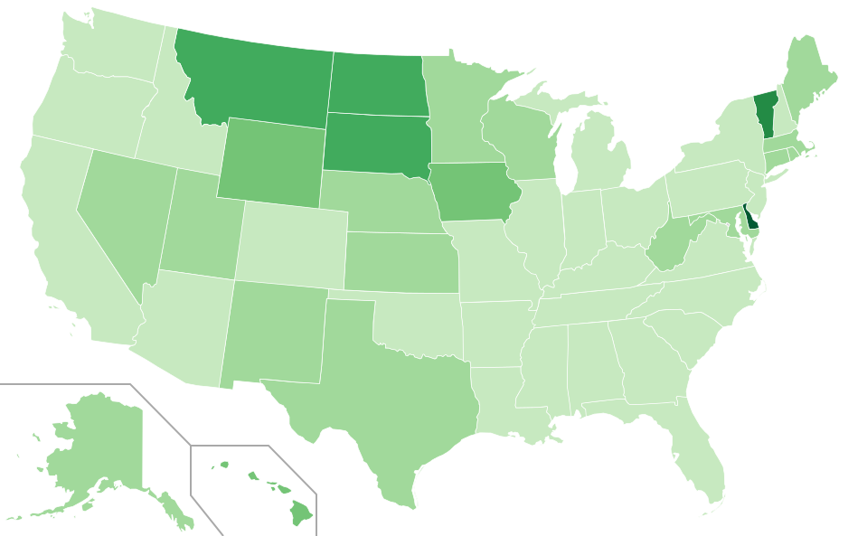

Title: Projects
Date: 2014-03-26
Authors: Roberto Gobbetti
Summary: Projects
Slug: projects

Here is a list of projects/ideas/stuff that I have worked or I am working on right now:

* [WhatHappenedThere?](http://whathappenedthere.xyz/): This app finds the Wikipedia page for any topic, downloads the time series of its daily visits, find spikes and connects them with relevant news in the New York Times. Have a look at my [blog entry](http://gobboph.github.io/blog/wht/) about it for more details about how it works.

* [NYC taxi rides](http://gobboph.github.io/blog/taxi_rides/): I took on analyzing the [TLC Trip Data](http://www.nyc.gov/html/tlc/html/about/trip_record_data.shtml) in order to find the areas and times that would give cab drivers higher returns for their time. Check out the [blog](http://gobboph.github.io/blog/taxi_rides/) for a deeper explanation and lots of cool maps!

* [Election Words](http://gobboph.github.io/election_words/):  Following up on congress_words (check just down here), I asked myself: what should one be talking about to be elected to congress? And how does that change state by state? To answer that I found out what the people that get re-elected a lot talk about and [here](http://gobboph.github.io/election_words/) is my (preliminary) analysis. You can find the project [on github](https://github.com/gobboph/election_words) and let me know what you think of it.

* [Congress Words (website)](http://gobboph.github.io/congress_words/): I extended the congress_words project above and rewrote it to make it a website ([here](http://gobboph.github.io/congress_words/)). I used only JavaScript and jQuery, there is no python script in the backend. Play with it! (And check it out [on github](https://github.com/gobboph/congress_words/tree/gh-pages)).

* [Congress Words](https://github.com/gobboph/congress_words): This python script outputs a map of the US in which each state is colored based on how many times a congress member from that state has pronunced the word or expression of your choice. To play around with the maps visit [this website](http://gobboph.github.io/congress_words/), where I implemented it online (see down under the map for details). Here is an example: a map genareted using the word 'welfare':

<!---->
<!---->

* [floodmyhood](http://gobboph.github.io/floodmyhood/): This ongoing collaborative project is aimed to show the effects of ice melting and its actual impact.

* [Portfolio Tracker](http://gobboph.github.io/Portfolio_Tracker/): This is a python tool that allows you to manage a stock portfolio. Just run the code and you will be able to buy the stocks that you want, see they value and the value of your portfolio.

